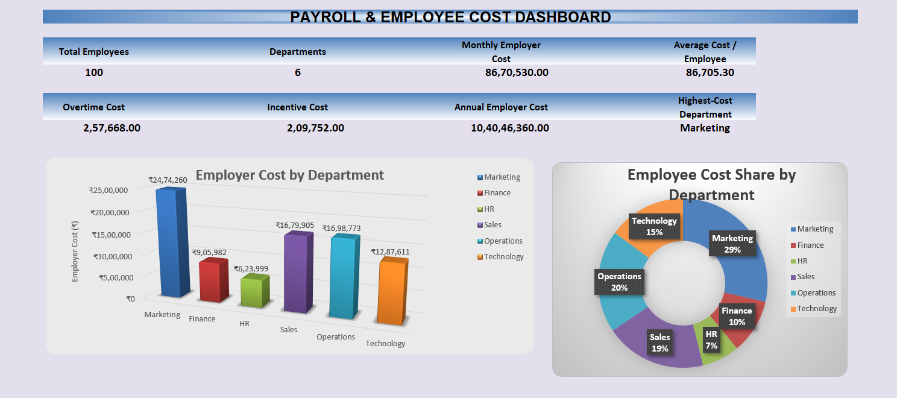
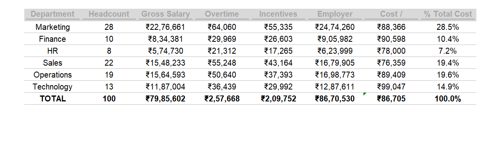
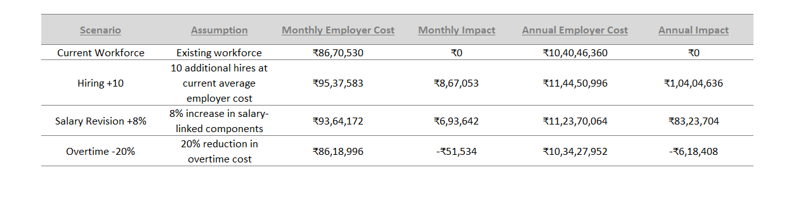

# Payroll & Employee Cost Analysis Model

An Excel-based payroll and employee cost analysis model developed during my Financial Analyst Internship at Adtric.

The project focuses on understanding employee-related costs from a financial analysis perspective and evaluating how changes in hiring, salary revisions and overtime can affect overall employer cost.

## Project Preview

### Dashboard

### Department Cost Analysis

### Scenario Analysis

## Project Overview

During my internship, I gained exposure to payroll management and basic accounting processes.

To further develop my financial analysis skills, I built an Excel-based analytical model covering:

- Payroll calculations
- Department-wise employee cost analysis
- Budget vs Actual analysis
- Employee cost variance
- Scenario analysis
- Management dashboard

## Key Results

The model analyzes a simulated workforce of 100 employees across 6 departments.

| Metric | Result |
|---|---:|
| Employees analyzed | 100 |
| Departments | 6 |
| Monthly employer cost | ₹86.71 lakh |
| Annual employer cost | ₹10.40 crore |
| Average monthly cost per employee | ₹86,705 |
| Highest total employee-cost department | Marketing |
| Highest cost per employee | Technology |

### Key Insights

- Marketing represents approximately 28.5% of total employee cost, primarily due to its higher headcount.
- Technology has the highest average employee cost at approximately ₹99,047 per employee per month.
- Sales has the highest unfavourable Budget vs Actual variance at 3.9%.

## Scenario Analysis

The model evaluates the financial impact of different workforce and compensation scenarios.

| Scenario | Monthly Impact | Annual Impact |
|---|---:|---:|
| Hiring +10 | +₹8.67 lakh | +₹1.04 crore |
| Salary Revision +8% | +₹6.94 lakh | +₹83.24 lakh |
| Overtime Reduction -20% | -₹51,534 | -₹6.18 lakh |

These are illustrative projections based on assumptions within the model.

## Excel Model Structure

The workbook contains:

- Employee Data
- Payroll Calculation
- Department Cost Analysis
- Budget vs Actual
- Scenario Analysis
- Dashboard
- Management Insights

## Tools Used

- Microsoft Excel
- Excel formulas
- Pivot Tables
- Data validation
- Charts
- Dashboarding
- Scenario analysis
- Financial analysis

## Excel Model

[View / Download the Excel Model](Excel_Model/Adtric_Payroll_Employee_Cost_Analysis_Model.xlsx)

## Data Disclaimer

The employee-level dataset used in this repository is simulated and does not contain actual employee payroll information from Adtric.

The model was developed based on learning and exposure gained during my Financial Analyst Internship. Actual company payroll data was not used because employee-level compensation information is confidential.

This project should therefore be viewed as an analytical learning project rather than an official company implementation.

## Key Learning

This project helped me understand how payroll data can be used beyond salary calculation to analyze:

- Employee cost drivers
- Department-level spending
- Budget variances
- Hiring decisions
- Salary revision impact
- Overtime-related costs

It strengthened my practical understanding of Excel-based financial analysis and employee cost management.

## Author

**Avanindra Pratap Singh**

MBA – Finance Major | Business Analytics Minor

Financial Analysis | Excel | Business Analytics

LinkedIn: https://www.linkedin.com/in/avanindra-pratap-singh/
